## Copy from YouTube to DiskYT

DiskYT does not host any of the YouTube videos.
To create a playlist (a Disk) you need to bring a link to a YouTube video or 
a YouTube playlist to DiskYT.

Before you may create your first Disk, you need to create a Station (the top folder) to host your Disks.

### Create a Station

Station is a top folder for your playlists. You may create as many stations as you want.
Inside Stations you may create Disks (playlists) and/or Folders (a collection of Disks).

To create a Station follow these steps:
- 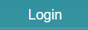 or 
 - 
Log in to DiskYT
- 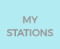 -
Click **My Stations** on the left (on a desktop/laptop browser)
-  -
Toggle Edit mode. 

The empty rectangle with an icon at the top left corner 
( 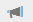 ) is a placeholder 
for your new Station:

 
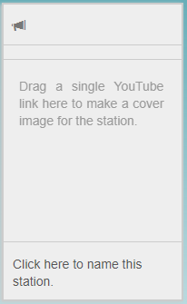

- Name the Station and click **Save**

 
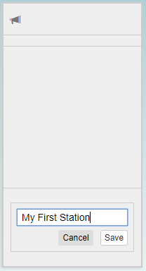

- Open YouTube in another browser tab, find a video with a thumbnail 
that you want to use as your new Station cover image

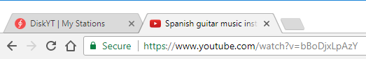

- Drag the link of this video from YouTube tab to the Station rectangle in the DiskYT tab:

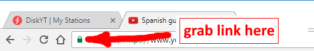

The result will look like this:

 
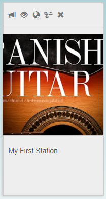

- 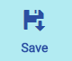 -
Click the blue **Save** button on the left.

Your first Station is ready at this point. 
Double click on the Station to create your first Disk (playlist).

### Create a Disk

The empty Disk placeholder in **Edit** mode looks like this:

 
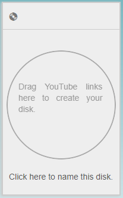

#### Add a single track

To add your first video to the disk follow the same steps 
as you did in the process of Station creation above:

- Open YouTube in another tab of the browser
- Find a YouTube video to add
- Drag it from the YouTube tab to the Disk placeholder in the DiskYT tab
- Click the blue **Save** button on the left

The result will be similar to this:

 
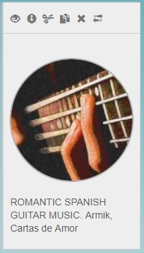

To change the name of the Disk click on the name, edit it and save your changes:

 
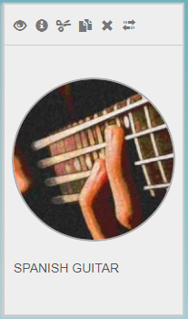

Repeat the same steps to add more tracks to the Disk.

The tracklist on the right will grow as you add more tracks:

 
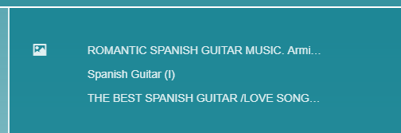

#### Add a playlist

Adding tracks one by one is a lot of work. Sometimes it's easier to grab 
a whole playlist from YouTube and add it in one shot. 
To do that find a playlist on YouTube and drag the playlist link to your DiskYT Disk.
Ensure that this is the playlist link and not just a single video from the playlist, 
watch for the word playlist in the URL:

 
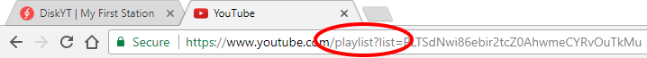

Alternatively the playlist URL may also look like this:

 

The resulting growing tracklist may look like this:

 
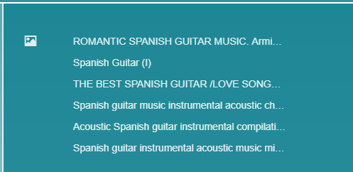

To change the name of any of the tracks in your playlist, just click on the name 
(in the **Edit** mode) and type your changes:

 
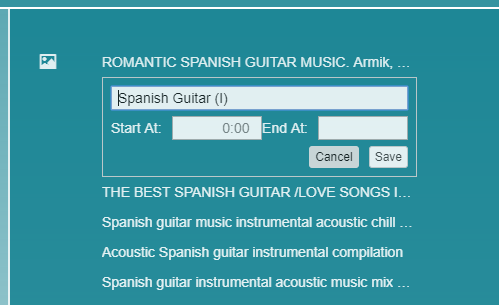

You may not only change the name of the track, but also its start and end time:

 
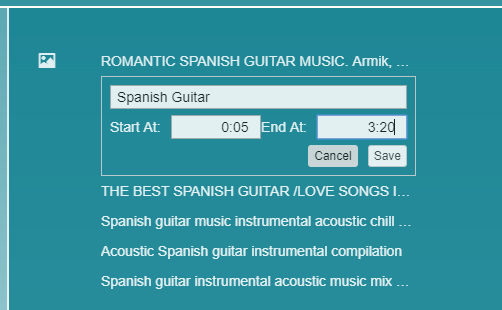

To delete a song from the playlist hover over the song and press the **x** next to it:

 

To change the cover image of the Disk to an image from any other song from your playlist, 
hover over the thumbnail of your song of choice and click the picture icon:

 

And if you want to hide a track in the **Play** mode without removing it completely 
from the list, Control+click the track and it will be disabled. 
This feature may be useful when you use a track as your Disk cover, 
but don't want it to be in the actual playlist:

 
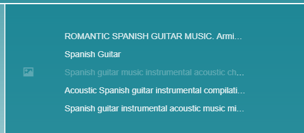

And while we are at it, to change the order of tracks in your playlist, 
just drag them across the playlist.

#### Split single compilation into multiple tracks

If a video that you added to the playlist is in fact a compilation of 
multiple tracks and the video description contains the tracklist details 
like this:

 
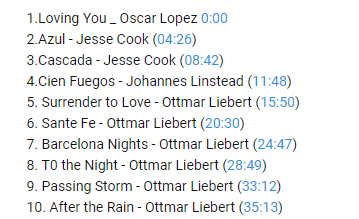

you may easily split this video into individual tracks if you click the 
vertical dots icon next to the video in the DiskYT playlist

 

and paste the tracklist into the text area:

 
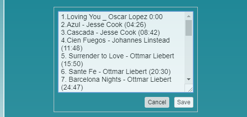

The resulting playlist will look like this:

 
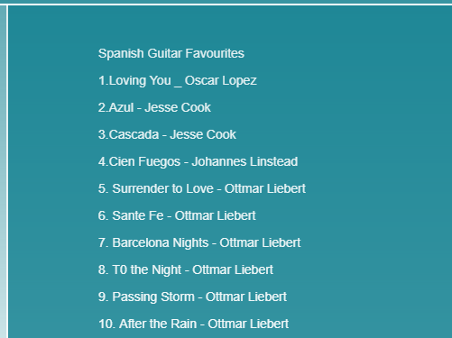

At this point you probably don't need the complete concert anymore and 
may delete the first entry in the playlist 
("Spanish Guitar Favourites" in our case).

### Create a Link to YouTube playlist

A regular DiskYT Disk created from a YouTube playlist is a copy of all of the items 
included in the original YouTube playlist. 
If the YouTube playlist changes later, these changes are not reflected in the DiskYT version and the
two playlists will diverge over time.
There is still a way to merge changes as described in the
[Copy To YouTube](CopyToYouTube.md) chapter 
(**Merge YouTube Playlist with the Existing DiskYT Playlist** section). 
But that's a manual process to syncronize the two lists. 
The alternative is to create a link to the YouTube playlist, 
which stays in sync with the YouTube source. 
Imagine a constantly changing list of podcasts and you want access to the latest
published episodes. This is what a Link to the YouTube playlist is all about. 
The behavior of the Link differs from the regular DiskYT Disk,
as you cannot add new items to it, but you can still remove items from the Link 
(think podcasts that you either already listened to or
are not interested in). Another feature of the Link is that it limits its list 
to the latest 50 items and drops old items over time.
There is a one day window when the Link can be out of sync with the original playlist 
as it updates itself at most once a day when it's accessed.

Link creation is a bit different from regular Disk creation 
as it's created in the **Play** mode and not in the **Edit** mode. 
The steps to create a new Link are the following:

- drill down to one of your Stations under **My Stations**
- Control+click anywhere outside of the Disks. 
An empty Disk placeholder is revealed:

 
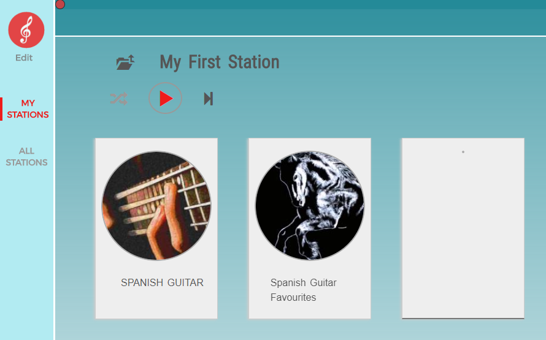

- Drag a YouTube playlist into the empty Disk placeholder:

 
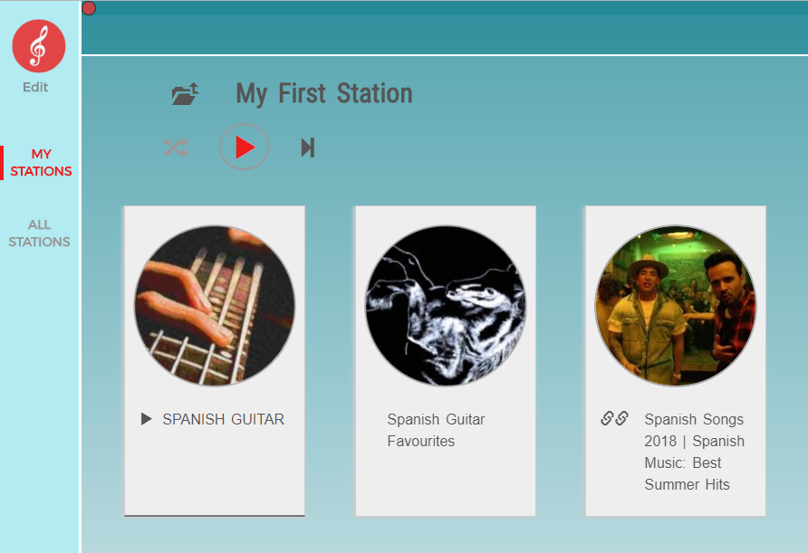

Note the double-link icon ( 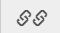 ) 
denoting the Link (you need to click away from the Link to see the icon).

Links can be a great way to stay in sync with ever changing YouTube playlists and to
still be in control of what is shown 
in your DiskYT world.

