## Copy DiskYT playlist to YouTube

To copy your DiskYT playlist back to YouTube there are several options. 

### Guest user

When a user is not logged in, he is considered a guest user. 
The guest user does not have access to **My Stations** or **Edit** mode. 
However guest users can still copy any of the playlists to their YouTube channel. 
To start the process Control+click on the DiskYT Disk that
you want to copy. This will lead to the **Copy to YouTube** page:

 
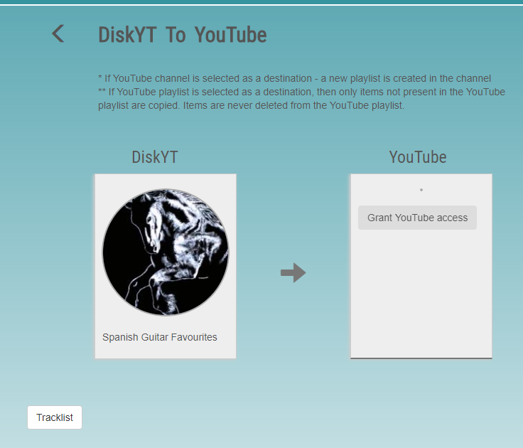

Here the DiskYT Disk represents your playlist source and the 
YouTube placeholder is the copy destination. Initially the destination
is not set and the first step to proceed with copying 
is to grant DiskYT access to your YouTube channel. 
Click **Grant YouTube access** and follow the Google instructions.
You can revoke the access at any moment. 
Once the access is granted the screen will look like this:

 
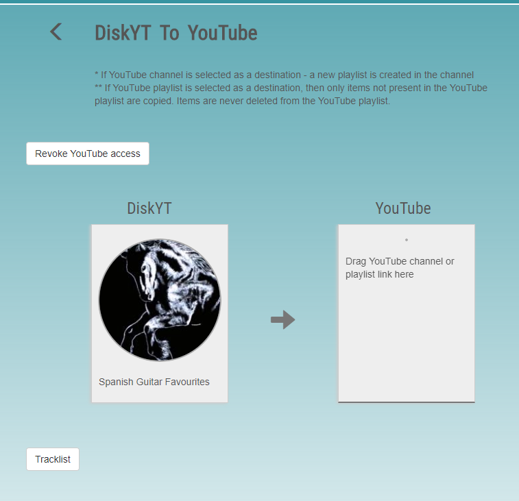

### Copy playlist to YouTube Channel

At this point, open your channel in another browser tab and 
drag the channel link to the YouTube destination in the DiskYT tab.

 
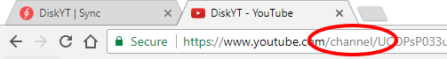

(Note the word "channel" in the YouTube channel link above).

Once the channel link lands in the YouTube destination on the DiskYT page, 
the list of items ready to copy is displayed and the blue action button becomes visible:

 
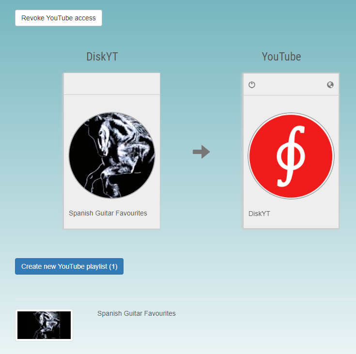

Once the YouTube channel is selected as the destination, then a copy 
of the complete playlist will be created in your channel. 
(Another option would be to select an existing playlist from your channel as discussed next).

Sometimes the source playlist displayed on this page is shorter, 
than the original playlist created on DiskYT.
This may happen if multiple tracks reference the same YouTube video, 
differing only in start/end times.
As YouTube does not support start/end time in the playlist entries, 
there is no point in copying the same
video to your YouTube playlist again and again. 
Only distinct videos are included into the playlist being copied to YouTube.

You still may see the complete playlist with all the time information, 
if you toggle the **Tracklist** button:

 
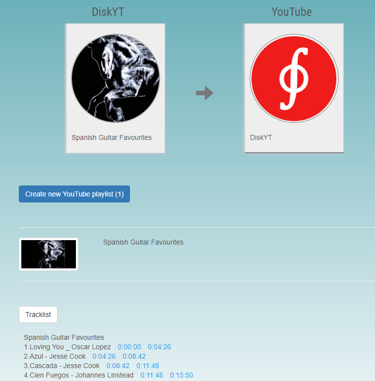

Click the **Create new YouTube playlist** button to start the copying process. 
The copy is complete when there are no items shown in 
the tracklist and the corresponding counter on the action button drops to zero. 
The button itself becomes disabled.

 
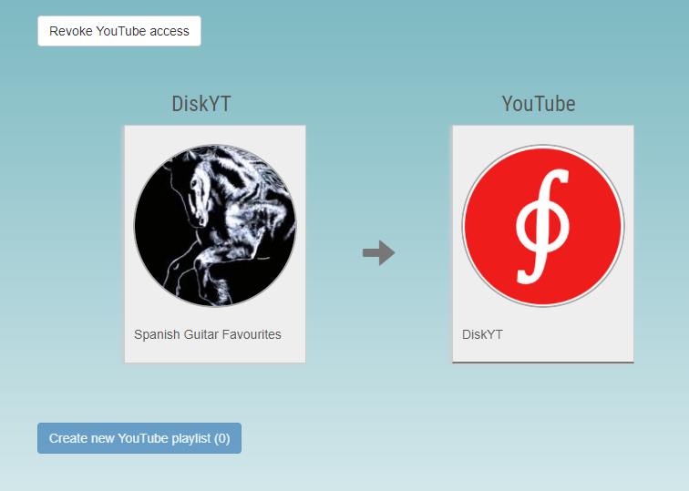

At this point a new public playlist is created on your YouTube channel.

### Registered users

For the logged in user, there is also another way to copy 
your playlists from the **My Stations** page.
Go to the **My Stations** page, drill down to the playlist you want to copy and 
switch to the **Edit** mode:

 
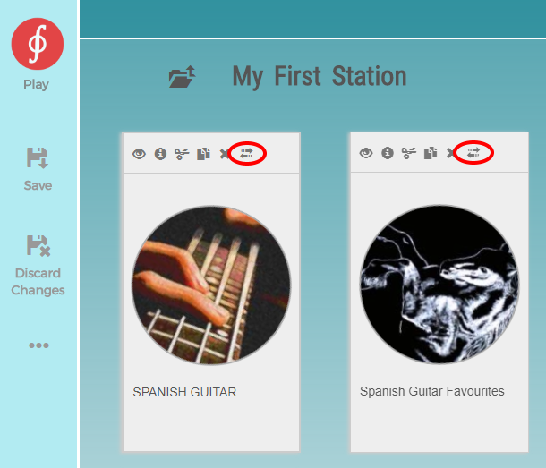

Notice the Sync button (  ) available for every Disk. 
Click it to open the **Copy to YouTube** page.
The process is very similar to the one outlined above for the guest users:

- Grant YouTube access
- Drag and drop your channel link
- Click the **Create new YouTube playlist** button

 
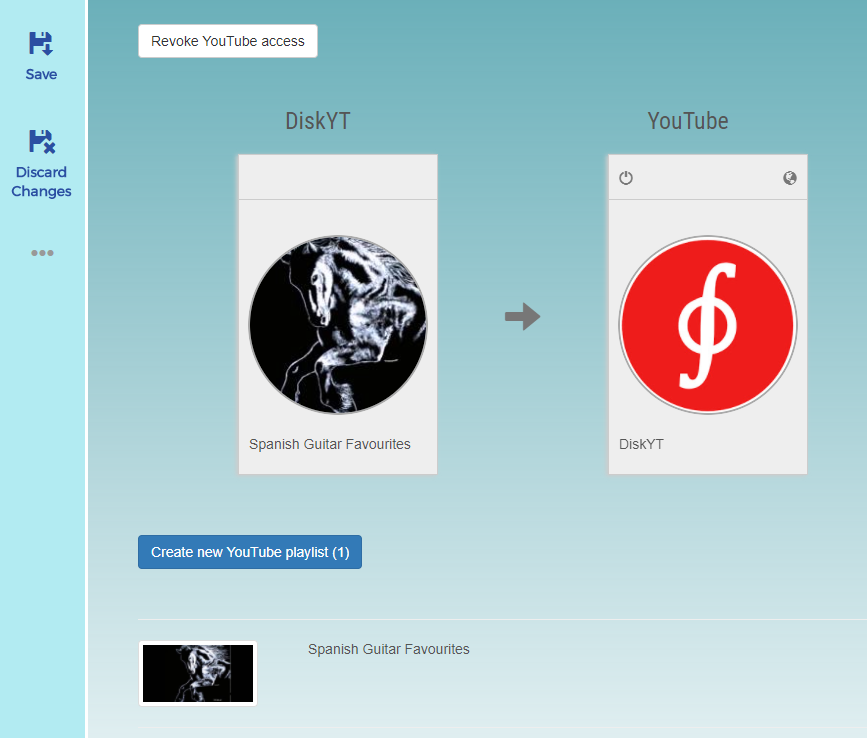

When the YouTube destination channel is selected, clicking the blue **Save** button 
on the left will save your choice
for the next time you copy the same playlist to your YouTube channel 
(it may be more useful when the
YouTube playlist is selected as a destination which is discussed below). 
You can always reset the destination by
clicking on the **Off** button in the top left corner of the YouTube destination.

By default, playlists on YouTube will be created as public, 
but you can change destination visibility by
toggling the top right icon (the globe) of the destination.

### Merge DiskYT playlist with the existing YouTube playlist

When selecting destination on YouTube for your DiskYT playlist, instead of a channel 
you may choose an existing playlist from your channel:

 
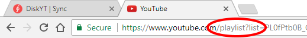

The process will be quite similar:

 
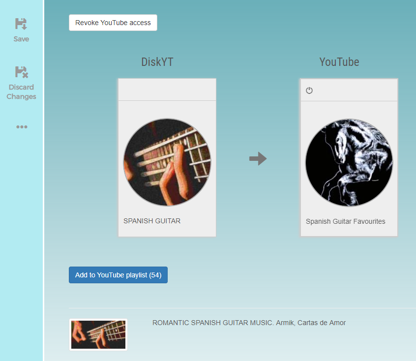

The main difference when copying a playlist over existing playlist is that 
videos already listed in the YouTube playlist
will not be copied. DiskYT never overwrites existing items in your list. 

The corollary to this - if you just copied your playlist
to the existing playlist (effectively merging them), 
the repeated copy operation will have no effect at all - everything is already copied.

### Merge YouTube playlist with the existing DiskYT playlist

While there are many ways to copy YouTube playlists to DiskYT, 
there is one additional way available on the current page.
Toggle the direction arrow between the DiskYT source and YouTube destination and 
the copy operation will reverse. 
The DiskYT playlist becomes a destination and the YouTube playlist becomes a source.

 
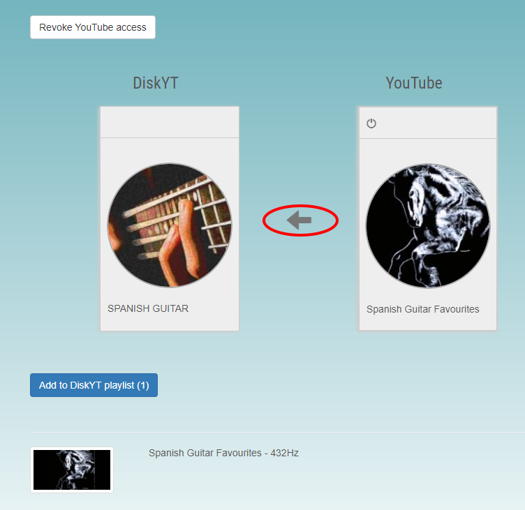

The same 'never overwrite' rule applies again - if the video is already 
part of the DiskYT playlist, it won't be overwritten by the copy(merge) operation.

### Use cases

Having an easy way to copy playlists between DiskYT and YouTube opens a lot of possibilities:

- You may easily copy playlists across your YouTube channels
- You may copy and modify existing YouTube playlists 
- You can merge multiple YouTube playlists from different users into your YouTube channel
- You can use DiskYT to backup existing YouTube playlists

The possibilities are really endless. Have fun!