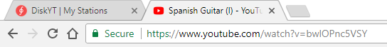
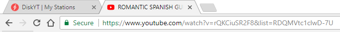
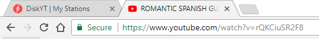
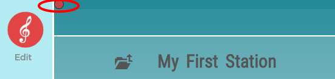
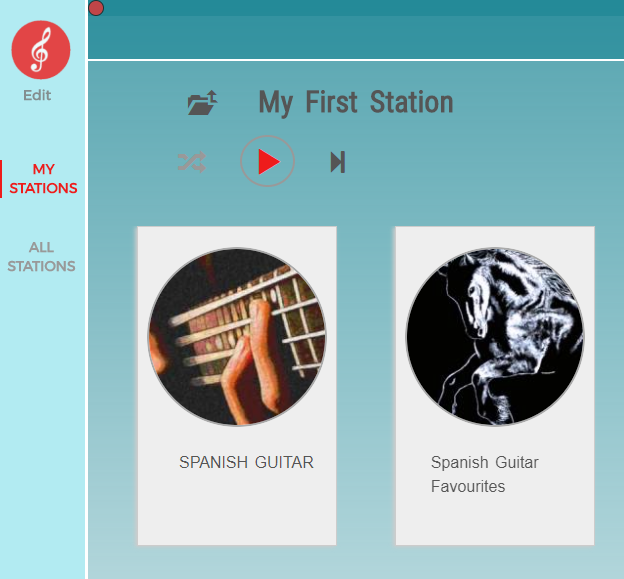
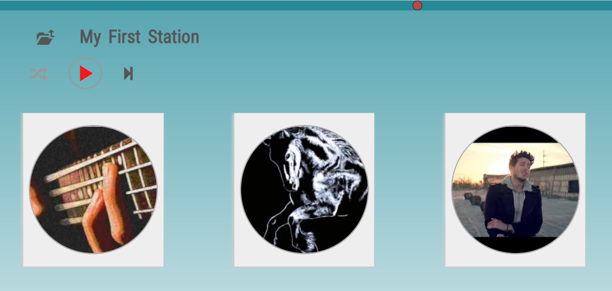
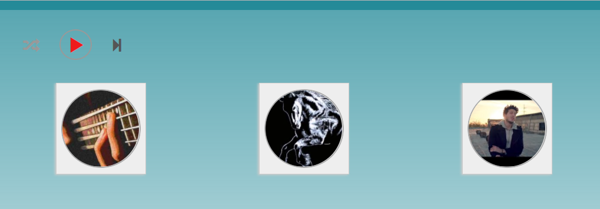

## Miscellaneous

### Adding a single video instead of a playlist

When you select a video on YouTube to bring it to DiskYT sometimes the video URL
is pretty clear and DiskYT has no problem realizing that you copy a single video.

For example this URL is obviously a single video URL:

However in other cases it may be not so straightforward:

This time URL contains both video id and a list id and DiskYT will interpret it
as a playlist URL. If your intention is to copy only a single video, 
you may edit the URL removing list part, 
reload the page and only then drag this new URL to DiskYT:

### DiskYT top slider

 

The top slider controls what is displayed on the page in the **Play** mode. 
By default DiskYT page 
in the desktop browser shows vertical toolbar on the left, page title, top menu and 
Disks with their cover images and names:

Moving slider to the right will drop some of the page elements:

And moving it even further will change the page even more.

The idea is to give you more control over your playlists presentation, 
to make the overall experience
more enjoyable.

### Undo

DiskYT does not remove your Disks immediately when you remove Disks from the page. 
It marks deleted Folders and Disks for removal 
and only after a while (one day maybe), deletes your Disks from the database.
Once you removed your Folders there is no way to restore the whole hierarchy, 
but recently removed
Disks still may be found on the **Undo** page. There is no visible link 
to the **Undo** page on DiskYT, 
but you can type the following URL in your browser address bar:

`https://diskyt.com/my-stations/page/undo`

If recently removed Disks are still available, they will be listed there. 
Switch to the **Edit** mode and copy these Disks to the Clipboard before it's too late.

### Browser local storage

DiskYT stores intermediate changes made on the page in the browser local storage first. 
These changes will stay even if you restart your browser. 
When you click the blue **Save** button on the left, these changes are sent
to the server and become persistent. Selecting **Discard Changes** button 
will clear the local storage and revert to the page state available from the server.

### Heartbeat

DiskYT sends a ping to the server every 5 minutes or so. 
After a certain time of inactivity it automatically jumps to the home page. 
This is done to prevent surprises in the **Edit** mode, when you resume
your page editing after a break, but cannot save your changes, 
because your server session expired by that time.

Going back from the home page to the page you just edited 
will restore the session automatically.
Note that all of your unsaved changes (if any) are still saved locally, 
so you just need to click **Save** button
after switching to the **Edit** mode to make all your changes persistent.

### Videos playable only on YouTube

Some YouTube videos have a flag to limit their playback to the YouTube site only. 
These videos cannot be played on DiskYT that uses embedded YouTube player.
When trying to play these videos they will silently disappear from the playlist and 
playback will move on to other songs. In the **Edit** mode these videos still
will be in the playlist, but shown as crossed out. There is not much that can be done 
about these videos, other than finding alternative videos on YouTube with
less restrictive playback policies.

In general any videos that cannot be played back on DiskYT would behave the same way - 
disappear from the playlist and shown as crossed out in the **Edit** mode.

There can be multiple reasons why some video fails to play 
(typical reasons would be video removed, made private, user account terminated and so on).

### Hole in the center of a Disk

It's possible to display a Disk with a hole in the center. 
To achieve that double click in the Disk center in the **Edit** mode and **Save** the changes.

