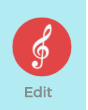
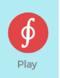
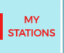
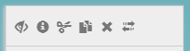
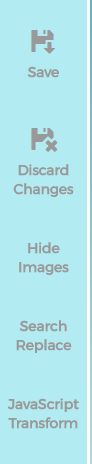

## Play/Edit mode

The **Play** mode is mainly just to listen to the existing playlists 
(it may be your playlists or somebody else's playlists).
You switch to the **Edit** mode to change your playlists - create new ones, add/remove songs, 
change songs start/end time, create new Stations and Folders and so on.
Most of the actions affecting playlists are only available in the **Edit** mode. 

The **Play** mode is the only mode available, when you are not logged in. 
Once you are logged in, you may switch to the **Edit** mode by clicking on the red treble clef
in the top left corner (on desktop/laptop): 

On a phone, the red treble clef is in the top right corner. 
(Note that **Edit** mode is not particularly useful on a phone
as most activities are centered around drag and drop, which is primarily a desktop feature).

The red treble clef turns into a different icon in the **Edit** mode:

(While the symbol is `closed loop integral`, we really did not mean it, 
it's more of a letter `f` with
a disk, where `f` stands for Fonograph/Phonograph).

Clicking the icon again toggles the **Play** mode back.

Every user starts his collection of playlists by creating a top folder first (we call it a Station). 
Users can create as many Stations as they want.
Right under Stations users may create either playlists (we call them Disks) or additional folders 
(folders are just Folders) to further separate collections of your playlists. 
The items in the playlists we often call Songs, 
even though any type of YouTube video may be in the playlist (Disk).

In **Edit** mode all your Stations are found in a page called **My Stations**. 
When you switch to the **Edit** mode this page is displayed automatically 
and **My Stations** is colored red on the left: 

Alternatively you can always open the **My Stations** page just by clicking **My Stations** on the left.
Note though that **My Stations** is not available until you log in.

Toggling the **Edit** mode changes both the visual representation of your Stations/Folders/Disks/Songs 
and also their behaviour. Visually at the top of each element
a row of action icons is displayed:  

These icons will be discussed in other chapters separately. 

Also depending on the page elements, additional icons
are displayed in the left toolbar: 

Behavior wise change becomes apparent when you start dragging 
elements on a screen (Disks/Songs/etc). 
The details of the drag and drop operations are described in later chapters as well.

While the **Play** mode is mostly a read-only mode (play-only), there are a few exceptions, 
when you still can make changes to your DiskYT page 
without explicitly switching to the **Edit** mode. 
If you drag a video or a playlist from the YouTube tab to your DiskYT page, you still may change
your page (depending on where on the page you drop the video or the playlist).
