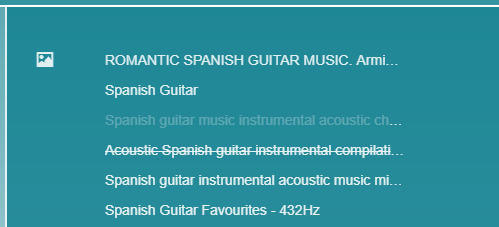
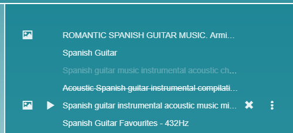
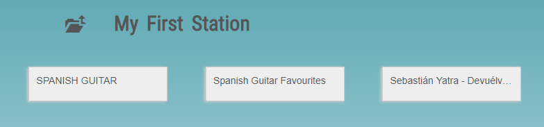

## Playlist operations

Each DiskYT Disk is essentially just a playlist. In **Edit** mode, 
when a Disk is selected, the associated playlist is displayed 
either on the right side of the page or below the Disks.

 

The grayed out entries in the Playlist are currently disabled and 
are not visible in the **Play** mode. To toggle
enabled/disabled state Control+click on the entry.

The crossed out entries mean there is a problem with their playback 
(video removed, account terminated, etc.).
They are also not displayed in the **Play** mode.

The entry with a picture icon designates the video used as a cover image for the Disk.

Hovering over Playlist entries reveals addional available operations:

 

-  - 
Changes Disk cover image to the current video thumbnail
-  - 
Plays current video without leaving **Edit** mode
-  - 
Deletes current video from the Playlist
-  - 
Splits a single YouTube video into multiple tracks based on the provided tracklist (see below)

As usual, changes made to the Playlist via any of the actions, must be eventually saved 
to make them persistent using **Save** button on the left 
(or discarded via **Discard Changes** button):

### Playlist drag and drop support

In the **Edit** mode any video from the Playlist may be dragged into another Disk 
available on the current page.
It will result in moving video from one Disk to another 
(unless the source Disk is a Link, in which case a copy
of the video will be created in the destination Disk). 
The destination Disk cannot be any type of Link though
(Links are marked with either single or double link icons: 
 ,   ).

Elements of the Playlist may be also moved within the Playlist itself 
in order to change the tracks order in the Playlist.

### Editing single track in the playlist

To change a single track name or start/end time click on the track 
in the Playlist in the **Edit** mode and edit proper fields:

 

Editing the start/end time allows you to play only some part of the video, 
which may be occasionally convenient. 
YouTube supported the start/end time feature in the past, but then abandoned it for some reason.
Because of this lack of support, when you copy your DiskYT playlist back to YouTube 
the start/end time cannot be copied and will be dropped in the process.

### Split single YouTube video

Often times a single YouTube video consists of many individual tracks or performances. 
In many cases a list of these tracks is provided in the video description 
or in the top comments. 

The typical format looks like this:

 

If you want to split a single video in the Playlist into multiple separate parts 
click vertical dots icon 
(  ) shown next to the video 
you want to split, paste the whole tracklist into the text area and click **Save**:

 

As a result multiple new tracks will be added to the Playlist. 
As these tracks and the original video are 
essentially the same, you may delete the original video at this point or 
disable it in the Playlist.

(Note that the split icon above is not available for the Playlist entries 
with the non-default start/end time).

### Add a list of YouTube URLs

Sometimes you bookmark multiple YouTube videos and later want to add all of them to a playlist.
In this case you may piggyback the same text area that was used to split tracklist above (  ),
but instead of the tracklist paste a list of YouTube URL (one URL per line):
<pre>
https://www.youtube.com/watch?v=6DrwYurnoPQ
https://www.youtube.com/watch?v=aUj2vdLt4JI
https://www.youtube.com/watch?v=jpv2tMJJuz0
</pre>

### Batch renaming 

In addition to the manual editing of the track names in the Playlist you may also use DiskYT
**Search/Replace** feature to rename multiple tracks in one go.

### Automation

Additonal ways of Playlist editing are available via DiskYT [scripting support](Automation.md).

### Multiple Disks on the page

If there are multiple Disks on the page and to reach some of them you need to scroll the page, 
dragging videos from the Playlist may become unwieldy. 
To avoid scrolling you may want to click **Hide Images** button
which helps to accomodate more Disks on the page without scrolling: 

The additional icons (like the **Hide Images** above) are displayed after you click the ellipsis 
(**...**) icon in the **Edit** mode:

The Disks without images would look like this:

To restore the Disk images, just toggle **Show Images** button again. 

