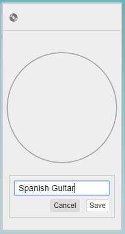
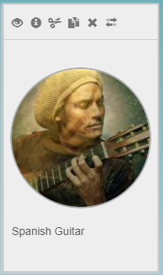
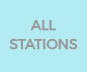

## Quick start

### Login and switch to **Edit** mode

To create your first playlist with DiskYT follow these steps:

-  or
 - 
Login with Google or Facebook (the **Login** button is on the top right)
-  -
Click the **My Stations** button on the left
-  -
Click the red treble clef icon (top left) to switch to the **Edit** mode

At this point you are ready to create your first DiskYT Station.

### Create Station

- Click at the bottom of this empty Station rectangle to name your first Station. 
Then click the **Save** button underneath.

 

- Open a YouTube video in another tab in the same browser and drag the video link 
(from the browser address bar) to your Station in the DiskYT tab of the browser:

 

(If everything goes well, the video thumbnail will be displayed as a cover image of your Station):

 

-  -
Click the blue **Save** button on the left to save your changes.

At this point, your first Station has been created, but it's still empty. 
Double click on the Station and start creating your first Disk.

### Create Disk

The process is very similar to the Station creation:

- Click at the bottom of the empty Disk to name it:

 

- Drag the video link from the YouTube tab to the Disk:

 

The first video thumbnail becomes the Disk cover image:

 

- Drag more video links from YouTube until your list is complete
-  -
Click the blue **Save** button on the left to save your changes.

Your first Disk is complete. 

### Enjoy your playlist

-  - 
Click the **All Stations** button on the left to see your new Station
- Drill down to get to your new Station (in other words, click on it)  
- Click on the Disk and start enjoying your new playlist! 

### But wait, there's more

If you feel underwhelmed at this point, it's because we haven't even scratched the DiskYT surface yet, 
there is so much more to DiskYT. Keep reading.
