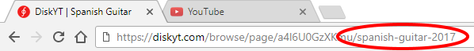
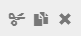
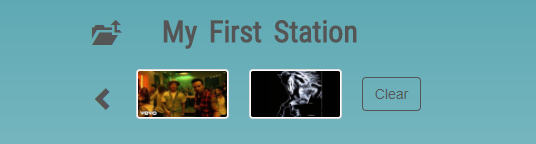
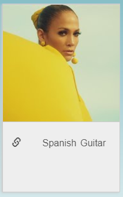
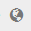
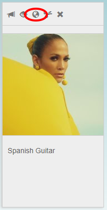
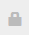
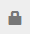
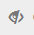
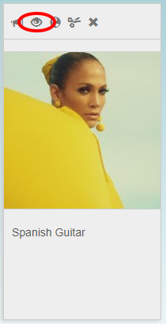

## Station, Folder, Disk operations

A quick DiskYT terminology overview. All DiskYT content resides in hierarchical Folders. 
Any Folder may contain
other Folders and also Disks, where each Disk is just a playlist. 
The top-level folder is called a Station. 
Only Stations are displayed in the **All Stations** and **My Stations** pages. 
The number of Stations per user is not limited.

Currently sort and search operations are limited to Stations only, making them somewhat special
in the big picture. And Stations are not only searched by name, 
but also by their tags or keywords (if any are provided).

The general process of creating a Station, Folder or Disk is essentially the same with just a 
few minor differences.

### Create a Station

- Log in to DiskYT
- Go to the **My Stations** page
- Switch to the **Edit** mode
- Find the Station placeholder

 

- Click on the bottom text to give the Station a name
- Drag a link to a YouTube video or a playlist from another browser tab
- Save the changes

The end result in the **Edit** mode will look like this:

 

You can drag another link from YouTube to change the Station image. 
You may also change the Station name at any time.

#### Station name

Station name may contain two other optional parts (separated by vertical bars '|'): 
keywords and slug.
An example of a Station's name: 

**Spanish Guitar|songs,dance,summer hits,2017|spanish-guitar-2017**.

Here the name includes these parts:

- Name - **Spanish Guitar**
- Keywords - **songs,dance,summer hits,2017**
- Slug - **spanish-guitar-2017**

There is no need to repeat the name itself in the keywords, as the search always includes 
name matching. 

The slug appears in the URL when you open the Station:

 

If the slug is not provided it's created automatically based on the Station name. 
In the example above
the automatic slug would be **spanish-guitar**.

The Station itself is not a playlist though - it's just a container for the Disks 
(actual playlists).
To create a Disk double click on the newly created Station in the **Edit** mode 
(or just click in **Play** mode) and follow the similar process.

### Create a Disk

If you follow the Station creation process, the Station page will already include 
a Disk placeholder:

 

If you created the Station a while ago, the initial steps would be:

- Log in to DiskYT
- Go to the **My Stations** page
- Click on the Station where you want to create a new Disk
- Switch to the **Edit** mode
- Find a Disk placeholder

At this point the process is almost identical to the Station creation:

- Click on the bottom text to give your Disk a name
- Drag a link to a YouTube video or a playlist from another browser tab
- Save the changes

Naming the Disk and adding the first video steps are interchangeable. 
If you start with the video
the initial Disk name will be set based on the video title. 
You can always change the name if it's not what you want for your Disk.

The step with adding a video or a playlist may be repeated as many times as you want 
to create the Disk you want.

The order of tracks in the Disk can be easily changed and 
unneeded tracks can always be removed or disabled.

Once you are done with one Disk, there is always an empty placeholder 
for the new Disk, when you are in the **Edit** mode,
so you can start creating another Disk and then one more and so on. 
At some point you may want to add more
order to your Disk collection and this is when you may consider 
creating additional Folders to split your Disk collection even further. 
Folder creation is discussed next.

### Create a Folder

A DiskYT Folder is just a collection of other Disks and/or Folders. 
As always with Folders they help
to organize big collections in a more structured way. 
As it was mentioned above, a Station is just a special
case of a top-level Folder. Folder creation is essentially identical 
to the Station creation, except you need to go at least one level deeper and 
there is no point in providing keywords in the Folder name.

To create a new Folder do the following:

- Log in to DiskYT
- Go to the **My Stations** page
- Select an existing Station and click on it
- Switch to the **Edit** mode
- Find an empty Disk placeholder and click the Disk icon (  ), 
which transforms into a Folder icon (  )
- Give the Folder a name
- Drag a link to a YouTube video or a playlist from another browser tab 
to create a cover image for the Folder
- Save the changes

To create Disks and/or Folders inside this new Folder either double-click on it 
to drill down into the Folder page, if the **Edit** mode is still on, 
or just click on the Folder, if you are already in the **Play** mode.

### Cut, copy, paste

Stations, Disks and Folders can be freely moved across your DiskYT pages. 
There are multiple ways to manipulate the content of your pages. 
You may either rely on action icons available for all elements
in the **Edit** mode or play with the drag and drop support 
either within a current page or across the multiple DiskYT tabs open in the browser.

Action icons include **cut**, **copy**, **remove** icons 
(  ). 
They are available at the top of Stations, Disks and Folders in the **Edit** mode. 
(The **copy** action is not available for the Stations and Folders). 

**Remove** action does what you expect and once you save your changes, 
your Station/Folder/Disk is gone.

The **cut** action will remove the element from the current page and 
put it into the Clipboard. The non-empty Clipboard
is displayed at the top of each of the **My Stations** pages:

 

The Clipboard displays thumbnails of the recently added elements 
(either after **cut** or **copy**). 
To retrieve an item from the Clipboard and add it to the current page, 
just click on the item in the Clipboard.
You would probably want to change the DiskYT page first, 
before you add the Clipboard item. 
Save your changes and your Station, Folder, Disk will have a new home.

If you move a Station into a Folder, this Station becomes just a regular Folder. 
And visa versa, if you move a Folder to the top-level 
it's automatically treated as a new Station.

If you want to move Stations, Folders or Disks within a single page 
it's usually easier to just drag it to a new place with your mouse. 
There is one catch though. You need to release the element you drag somewhere
on another element, just dropping the element anywhere on the empty space will not work. 
For example grab one Disk,
drag it until you hover over another Disk and then release it. 
The order of the Disks on the screen will change as a result.

If you want to move a Disk into a Folder on the same page using drag and drop, 
just keep the Control key pressed and drag the Disk into the Folder. 
Save your changes and the Disk will be inside the Folder.

If you want to merge two Disks just drag one Disk over another Disk with the Control key pressed. 
Ensure that your merge target is not some sort of Link 
(denoted with either a single link icon  
or a double link icon  
). Merging with the Link will not work.

You may also drag DiskYT elements across multiple open browser tabs. 
Open one of your pages under **My Stations**
in one tab and switch to the **Edit** mode. It will be our destination page. 
Then open another DiskYT page in another tab 
(this other page is not necessarily your page, it can also
be a page from any other user). 
This one will be our source page. Drag any Disk from the source page into
the destination page and land it on the empty Disk available on your page in the **Edit** mode. 
A copy of the source Disk is created on the destination page.

If you don't want to create a copy of the source Disk, 
but instead want it to be a Link, the process would be slightly different. 
The difference between a Link and a copy of the Disk is that a Link will always reflect
the current context of the original Disk. 
The downside is that you have less control over the Link, 
as you cannot remove any videos from it or change the order. 
To create the Link open destination page in the **Play** mode
and Control+click anywhere on the empty space of the page. 
An empty Disk placeholder will be displayed on the page:

 

Open the source page in another tab and drag a Disk to the empty placeholder. 
A Link to the original Disk will be created. 
If you select another Disk on the page you will notice a single-link icon 
(  )
marking the Link:

 

If instead of a Disk you drag a Station or a Folder from the source page, 
a Link to the Station or Folder is created instead. 
It becomes a convenient way to jump to another page from anywhere you want:

 

### Station privacy settings

Similar to YouTube, every user's Station may have one of the following privacy settings:

- Public
- Unlisted
- Private

The meaning of the settings is similar to YouTube. 
Public channels are visible to everyone and may be displayed in search results. 
Unlisted settings require knowing the exact link of the channel in order to view
it. Private channels are visible only to the user who created it and 
only when this user is logged in.
Making your channel private or unlisted effectively hides the channel itself and 
all its content (Folders, Disks) from all other DiskYT visitors.

The default Station visibility is Public - see the globe icon in the top bar 
of the Station in Edit mode
(  ):

 

To change Station privacy settings toggle the icon. Changing it to the light-grey padlock 
(  ) means unlisted channel. 
Darker padlock denotes a private channel (  ).

### Enable/disable

All three DiskYT page elements (Station, Folder, Disk) may be temporarily disabled. 
Disabled elements are not shown in the **Play** mode, 
but may be made visible again with a single click. 
Don't rely on disabling 
elements for privacy purposes - the elements still may be in the page source code, 
they are just not displayed on the screen. 
To enable/disable the element, toggle the eye icon. 
An element in the **enabled** state displays this icon 
(  ), 
and an element in the **disabled** state shows this one 
(  ).

 

### Automation and scripting

Note that the Station, Folder, and Disk operations described so far were manual operations. 
In addition to the manual
operations, DiskYT also supports script based automation - 
you may create new Disks and Folders, as well as, 
change existing ones either by editing directly underlying page data structures or by 
providing a script to do it for you. 
This is an advanced topic and it's discussed in more details in the
[Transform](Transform.md) chapter.

