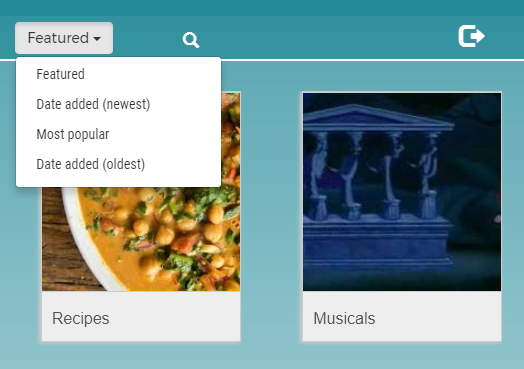
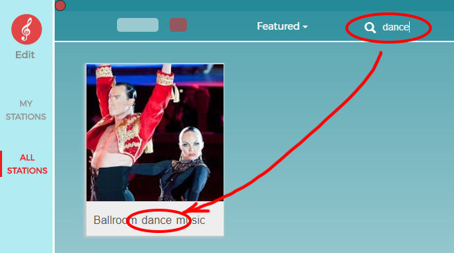

## Station Sort and Search

### Station sort

Sort operation applies only to the Stations in **Play** mode. 
The Stations are displayed on the **All Stations** page:

The sort selection is at the top of the **All Stations** page:

By default, the main page shows **Featured** Stations (whatever that means). 
The three other types of sorting order are shown below:

The **Most popular** sorting order is based on a combined number of views received 
by the Station Disks.

The Station obviously must be enabled and have privacy settings set to **Public**, 
in order to be included in **All Stations** page.

### Station search

Current DiskYT search capabilities are very limited. 
The search is mainly based on a substring search in Stations' names. 
Each Station may also provide a list of keywords that DiskYT will try to match as well.
The search was not a priority yet, so don't expect too much from it. 

A typical search result would look like this:

More details about adding keywords to the Station name may be found [here](StationFolderDiskOperations.md) - 
check the **Station Name** subsection.

