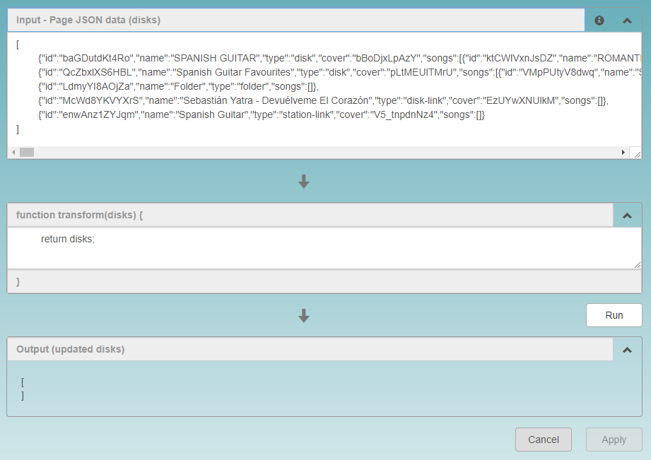

## Scripting and direct editing of the DiskYT page

### Introduction

In most cases drag and drop support in DiskYT pages is sufficient. It allows to easily
move Disks and videos around without much effort. However there can be occasionally advanced
scenarios, where manual processing becomes cumbersome. Imagine gathering multiple audio books
playlists and creating separate disks for the all main authors. It will be rather time consuming
to move manually all the titles from all the playlists. In this case scripting changes may be
a more efficient solution. As lingua franca of all modern browsers is JavaScript, 
DiskYT supports scripting via this language.

Of course writing scripts may be challenging, if you never learned the language before - 
that's why it's considered an advanced scenario. 
However once you managed the basics the possibilities
are endless.

In some cases there is even no need in actual scripting - direct manipulation of your playlists
in a text form could be all you want. For this reason DiskYT offers 
two distinct ways to manipulate your playlists. 
On the **Transform** page there are three separate stacked panels - first two are
used to input user data and script code and 
the last one is the output panel showing the outcome of the process:

<p align="center"> 

</p>


### Direct editing

The top panel is named **Input - Page JSON data (disks)**. 
It lists data describing all the Disks on the page
with all their songs. The data format is JSON, which is a subset of a general JavaScript.
While the data presentation in this format may look daunting to uninitiated user, 
in reality it's rather straightforward. 
The square brackets mark a collection of comma separated elements (an array)
and curly brackets denote a set of element attributes.

The structure presented in the top panel is always the same - it's an array of disks where
each disk has a name, an id, some other properties and a list of songs (an array of songs).

More formally the disk structure is:

`{ id, name, type, cover, changed, custom, songs }`

and the song structure is

`song: { id, name, video_id, start, end, isCover }`

The `changed` attribute is optional and is set to `true` 
only if there are unsaved changes in the Disk object.
It may help to detect new Disks created on the page. 
This attribute is read-only, it cannot be changed or copied back into the output.

The `custom` attribute is an optional placeholder for user data 
(it should be an alpha-numeric or base64 string up to 80 characters). 
It has no intrinsic meaning inside the app.

Optional `start/end` attributes allow to specify each song start and/or 
end as a string in format `0:00`.

For example a typical page with a single Disk and two songs may look like this:

```
[
	{"id":"gNM9vdpOLXLr","name":"Toto CUTUGNO - Love Songs","type":"disk","cover":"l6UBnOU5mKg",
		"songs":[
			{"id":"4Or7wRK6Fr2z","name":"01. Serenata",
				"start":"00:00:08", "end":"00:03:54","video_id":"l6UBnOU5mKg","isCover":true},
			{"id":"pCeIZT2Nz0Ht","name":"02. Buonanotte",
				"start":"00:03:54","end":"00:08:25","video_id":"l6UBnOU5mKg"}
		]
	}
]
```

This data may be edited directly in the top panel to make changes you need 
(like renaming Disks and songs, changing Disk or song order, 
rearranging songs into a new Disk and so on). 
As long as the overall structure is preserved and new `video_ids` are not introduced
the DiskYT will happily accept the changes. 

You don't need to worry about `id` properties above. 
If you create a new disk, this `id` property may be left out and 
DiskYT will generate one for you. 
To validate your changes click **Run** button under the second panel and if everything
is alright, then your changes will be displayed in the bottom panel 
(named **Output (updated disks)**). 
At this point the changes are still not applied to the page. 
If you are satisfied with the results, click **Apply** button 
under the bottom panel (or **Cancel** otherwise).

Once the changes are applied to the page, the Disks and their content on the page 
reflect these changes. 
At this point these changes are persisted locally (in the browser local storage), 
but are not propagated back to the server yet. 
To finalize the changes click the **Save** button on the left of the screen.
If everything goes according to the plan, the new page data is saved on the server and 
becomes truly persistent.

### Scripting

The second panel on the **Transform** page contains a content of the `transform` function 
applied to the data from the top panel.
It receives `disks` structure as an input and must return 
modified `disks` structure as its output. 
What exactly you do with the data is up to you -
you may combine all the Disks into a single one or split existing Disks into some other 
Disks based on your own criteria. 
You may filter out some of the songs or shuffle them around. The possibilities are endless.

Once your script is ready, the steps are the same as with the direct data manipulation above. 
Click **Run** button to validate your changes, then **Apply** and 
finally the **Save** button on the left.

Nothing prevents you from doing both direct manipulation and scripting at the same time. 
Your modified data is fed into your script in the `transform`
function and then the script is applied.

### Creating new pages via scripting

There is a special case of scripting where instead of manipulating an array of disks from 
the current page, you provide a completely new structure for the pages (or even its subpages). 
Note that this technique must be used on an empty page as the current page context
is deleted. The new data structure for the simplest case of creating a single new folder 
on the current page will look like this:

```
{
	"": [{"cover":"C0DPdy98e4c", "name":"Folder Name", "type":"folder"}]
}
```

Here empty string property denotes the current page. The value of the property is the same 
array structure that is by default used in the top panel for the disk array.

This data may be either provided in the top panel or returned from the `transform` function 
(the content of the second panel).

To create more than one page in one go, you would add a new `subPageId` property to the folder 
that leads to the subpage and then describe the subpage as a separate entry:

```
{
	"": [ { "cover":"C0DPdy98e4c", "name":"Folder Name", "type":"folder", "subPageId":"mySubPageId" } ],
	"mySubPageId": [ { "cover":"_vCclz57YrE", "name":"Disk Name", "songs": [] } ]
}
```

After clicking **Run** a new Folder with the name `Folder Name` will be created 
on the current page
(and all its other content will be deleted). In addition to the Folder a new Disk with 
the name `Disk Name` will be created on another page. 
This page is reached when this new Folder is clicked.

The actual value of the `subPageId` is irrelevant as long as there is a match 
between this value and the property name 
describing this subpage (see two occurrences of `mySubPageId` above).

### Miscellaneous

The changes made on the page after running transformation and 
saving the changes are persistent.
However the raw data itself or a transformation script provided 
in any of the input panels on the **Transform** page 
are not persisted, they will not survive page reload.
If you plan to reuse your script or data, save them manually on your computer. 

Note that `songs` property may be modified via transform only 
for the Disks with the `type='disk'`.

Unless you follow **Creating New Pages** scenario,
new Disks may only have `type='disk'`, which is the default type
and new songs cannot be added to them (new `video_id`), but existing songs may be renamed, 
rearranged between Disks or removed.
In **Creating New Pages** scenario on the other hand, 
you start with a clean slate and are completely 
in charge of all the data for your pages and subpages.

As the data and script on the **Transform** page are eventually fed 
into browser JavaScript engine, the escaping of
special symbols (like back quotes or back slashes) may become tricky.
In case of `SyntaxErrors` check if you can remove back slashes(`\`) 
and back quotes(`` ` ``) from your data and code.
Back slashes escaping quotes(` \" `) are probably OK, 
but back slashes escaping back slashes (` \\ `) 
are probably not. Try to avoid these symbols, if possible, to make parsing less error prone.

A side benefit of having access to the raw data describing your DiskYT page 
(top panel on the **Transform** page), 
is that you can easily copy this data for archiving purposes and then recreate your pages 
if anything goes wrong with any of your playlists.


